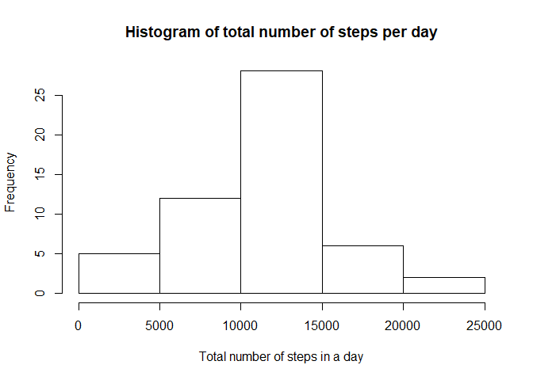
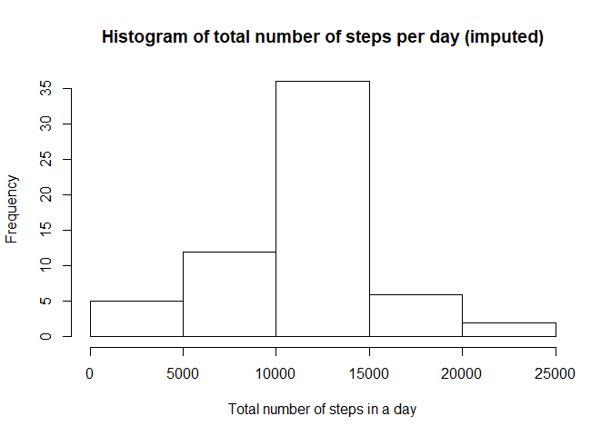

----  

This project explores the data from a personal activity monitoring device (such as Fitbit, Nike's Fuelband or Jawbone Up) collected at 5 minutes interval throughout the day during the months of Oct and Nov 2012.  

The data is made available from: <https://d396qusza40orc.cloudfront.net/repdata%2Fdata%2Factivity.zip>  

The variables included in this dataset are:  
    1. **steps**: Number of steps taking in a 5-minute interval (missing values are coded as NA)  
    2. **date**: The date on which the measurement was taken in YYYY-MM-DD format  
    3. **interval**: Identifier for the 5-minute interval in which measurement was taken  
  
----

First we load the data.   


```r
#check directory and create
setwd("D:/My Documents/Coursera/John Hopkins Specialization in Data Science/Reproducible Research/Project 1")
if ( !file.exists( "data" )) {
    dir.create ( "data" )
}
downloadDate <- gsub(":",".",date())
target_url <- "https://d396qusza40orc.cloudfront.net/repdata%2Fdata%2Factivity.zip"
destfile <- paste0("./data/activity data",downloadDate,".zip" )
download.file(target_url, destfile=destfile, method="curl")

fname <- unzip(destfile)
unzip(destfile, files=fname, exdir="./data", overwrite=TRUE)
```

```
## Warning in unzip(destfile, files = fname, exdir = "./data", overwrite = TRUE):
## requested file not found in the zip file
```

```r
fpath <- file.path("./data", fname)

df <- read.csv(fpath)

#remove NA in df
df_clean <- df[ with (df, { !(is.na(steps)) } ), ]
```

Q1. What is mean total number of steps taken per day?
-----------------------------------------------------

* Calculate the total number of steps taken per day

```r
by_day <- group_by(df_clean, date)
steps_by_day <- summarise(by_day, total = sum(steps))
steps_by_day
```

```
## # A tibble: 53 x 2
##    date       total
##    <fct>      <int>
##  1 2012-10-02   126
##  2 2012-10-03 11352
##  3 2012-10-04 12116
##  4 2012-10-05 13294
##  5 2012-10-06 15420
##  6 2012-10-07 11015
##  7 2012-10-09 12811
##  8 2012-10-10  9900
##  9 2012-10-11 10304
## 10 2012-10-12 17382
## # ... with 43 more rows
```

Note that for days with zero steps, results may have been due to NA's.  
  
<br>
<br>

* Make a histogram of the total number of steps taken each day

```r
hist(steps_by_day$total, main="Histogram of total number of steps per day", 
     xlab="Total number of steps in a day")
```

<!-- -->
<br><br><br>

* Calculate and report the **mean** and **median** total number of steps taken per day 


```r
summary(steps_by_day)
```

```
##          date        total      
##  2012-10-02: 1   Min.   :   41  
##  2012-10-03: 1   1st Qu.: 8841  
##  2012-10-04: 1   Median :10765  
##  2012-10-05: 1   Mean   :10766  
##  2012-10-06: 1   3rd Qu.:13294  
##  2012-10-07: 1   Max.   :21194  
##  (Other)   :47
```

<br><br><br>

Q2. What is the average daily activity pattern?
-----------------------------------------------------


* Make a time series plot (type = "l") of the 5-minute interval (x-axis) and the average number of steps taken, averaged across all days (y-axis)

```r
# preprocessing data for plot
steps_by_interval <- aggregate(steps ~ interval, df_clean, mean)

# create a time series plot 
plot(steps_by_interval$interval, steps_by_interval$steps, type='l', 
     main="Average number of steps over all days", xlab="Interval", 
     ylab="Average number of steps")
```

<!-- -->
<br><br>

* Which 5-minute interval, on average across all the days in the dataset, contains the maximum number of steps?

```r
# find row with max of steps
max_steps_row <- which.max(steps_by_interval$steps)

# find interval with this max
steps_by_interval[max_steps_row, ]
```

```
##     interval    steps
## 104      835 206.1698
```

Q3. Imputting missing values
-----------------------------------------------------

* Calculate and report the total number of missing values in the dataset (i.e. the total number of rows with NAs)

```r
sum(is.na(df))
```

```
## [1] 2304
```
<br>
* Devise a strategy for filling in all of the missing values in the dataset.

```r
data_imputed <- df
for (i in 1:nrow(data_imputed)) {
  if (is.na(data_imputed$steps[i])) {
    interval_value <- data_imputed$interval[i]
    steps_value <- steps_by_interval[
      steps_by_interval$interval == interval_value,]
    data_imputed$steps[i] <- steps_value$steps
  }
}
```
My strategy is to replace NAs with the mean for that 5-min interval 

<br>

* Create a new dataset that is equal to the original dataset but with the missing data filled in.

```r
df_imputed_steps_by_day <- aggregate(steps ~ date, data_imputed, sum)

head(df_imputed_steps_by_day)
```

```
##         date    steps
## 1 2012-10-01 10766.19
## 2 2012-10-02   126.00
## 3 2012-10-03 11352.00
## 4 2012-10-04 12116.00
## 5 2012-10-05 13294.00
## 6 2012-10-06 15420.00
```

I’ve created new data set data_no_na which equals to df but without NA’s. All NA’s are replaced with mean of 5-minute interval.
<br>

* Make a histogram of the total number of steps taken each day and Calculate and report the mean and median total number of steps taken per day. Do these values differ from the estimates from the first part of the assignment? What is the impact of imputing missing data on the estimates of the total daily number of steps?

```r
hist(df_imputed_steps_by_day$steps, main="Histogram of total number of steps per day (imputed)", 
     xlab="Total number of steps in a day")
```

<!-- -->

```r
# get mean and median of imputed data
mean(df_imputed_steps_by_day$steps)
```

```
## [1] 10766.19
```

```r
median(df_imputed_steps_by_day$steps)
```

```
## [1] 10766.19
```

```r
# get mean and median of data without NA's
mean(steps_by_day$total)
```

```
## [1] 10766.19
```

```r
median(steps_by_day$total)
```

```
## [1] 10765
```
<br><br><br>

Q4. Are there differences in activity patterns between weekdays and weekends?
-----------------------------------------------------------------------------

* Create a new factor variable in the dataset with two levels – “weekday” and “weekend” indicating whether a given date is a weekday or weekend day.

```r
data_imputed['type_of_day'] <- weekdays(as.Date(data_imputed$date))

data_imputed$type_of_day[data_imputed$type_of_day  %in% c('Saturday','Sunday') ] <- "weekend"

data_imputed$type_of_day[data_imputed$type_of_day != "weekend"] <- "weekday"
```
<br><br>

* Make a panel plot containing a time series plot (i.e. type = "l"|}type = "l") of the 5-minute interval (x-axis) and the average number of steps taken, averaged across all weekday days or weekend days (y-axis)


```r
# convert type_of_day from character to factor
data_imputed$type_of_day <- as.factor(data_imputed$type_of_day)

# calculate average steps by interval across all days
df_imputed_steps_by_interval <- aggregate(steps ~ interval + type_of_day, data_imputed, mean)

# creat a plot
qplot(interval, 
      steps, 
      data = df_imputed_steps_by_interval, 
      type = 'l', 
      geom=c("line"),
      xlab = "Interval", 
      ylab = "Number of steps", 
      main = "") +
  facet_wrap(~ type_of_day, ncol = 1)
```

```
## Warning: Ignoring unknown parameters: type
```

<!-- -->
